## Joint Work With

::: {style="text-align: center; font-size: 1.3em; margin-top: 1em;"}
**Jialin Liu** (U. Central Florida)

**Lisang Ding** (UCLA)

**Stanley Osher** (UCLA)
:::

::: {style="text-align: center; margin-top: 2em;"}
Jan 2026
:::

::: {style="text-align: center; font-size: 0.9em; margin-top: 1em;"}
Based on: *Implicit Models: Expressive Power Scales with Test-Time Compute*

arXiv:2510.03638 (2025)
:::

::: notes
Acknowledge co-authors.
:::

---

## The Rise of Implicit Models

**Explicit model:** Learn $F(\mathbf{x})$ directly (explicit model)

**Implicit alternative:** Learn operator $G(\cdot,\mathbf(x))$ whose fixed point is the answer

$$\mathbf{y}_* = G(\mathbf{y}_*, \mathbf{x})$$

At inference: iterate to return an approximate fixed point

$$\mathbf{y}_1 = G(\mathbf{0}, \mathbf{x}), \quad \mathbf{y}_2 = G(\mathbf{y}_1, \mathbf{x}), \quad \ldots$$

::: notes
Introduce the basic concept. Explicit = one-shot feedforward. Implicit = iterate to equilibrium.
:::

---

## Implicit Models

::: {style="font-size: 0.9em;"}
:::: {.columns}
::: {.column width="50%"}
- **Image reconstruction** [@gilton2021deep]
- **Scientific computing** [@marwah2023deep]
- **Generative modeling** [@pokle2022deep; @geng2023one]
:::
::: {.column width="50%"}
- **LLM reasoning** [@geiping2025scaling]
- **Operations research** [@fung2022jfb]
- **Game theory** [@mckenzie2024three]
:::
::::

**Common:** implicit models often *exceed* larger explicit networks
:::

::: notes
Applications spanning multiple domains. The empirical success is widespread.
:::

---

## Why Are Implicit Models Compelling?

::: {style="font-size: 0.9em;"}
1. **Memory efficiency:** Infinite-depth weight-tied network

2. **Structure incorporation:** Naturally "bake in" physics, geometry, constraints

3. **Performance mystery:** *Exceeds larger explicit networks*
:::


::: {.callout-note appearance="minimal"}
Points (i) and (ii) are well understood.

**Point (iii) remains unexplained.**
:::

::: notes
Three advantages. First two are architectural. Third is the mystery we address.
:::

---

## The Central Mystery

::: {.r-fit-text style="text-align: center;"}
How can a **simple** operator $G$

represent a **complex** mapping $F$

just by **iterating more**?
:::

::: notes
This is the core question. State it clearly before diving in.
:::

---

## Two Fundamental Questions

**Q1: Do implicit models match explicit ones?**

For any target $F$, does there exist $G$ such that $\mathbf{y}_t(\mathbf{x}) \to \mathbf{y}_\ast(\mathbf{x}) \approx F(\mathbf{x})$?

. . .

**Q2: Do they offer an expressive advantage?**

Can a *simple* $G$ represent a *complex* $F$ through iteration?

. . .

::: {.callout-note appearance="minimal"}
A positive answer to Q2 would explain phenomenon (iii).
:::

::: notes
Frame the two questions. Q1 is baseline. Q2 is the insight.
:::

---

## Prior Work: A Gap

- Universality touched upon in specific settings [@bai2019deep; @marwah2023deep]
- Separation results show advantages over explicit models [@wu2024separation]


**What's missing:**

A complete characterization of the function class that implicit models can represent

::: notes
Acknowledge prior work. Identify the gap we fill.
:::

---

## Our Contribution

::: {style="font-size: 0.9em;"}
**A nonparametric, function-space characterization:**

1. **Expressive boundary:** *Regular* implicit models can represent *locally Lipschitz* maps 

2. **Emergent power:** Regular $G$ + iterations $\to$ *locally Lipschitz* maps

3. **Validation:** Four domains confirm theory empirically
:::

::: {.callout-note appearance="minimal"}
**Key insight:** An implicit model's expressive power *scales with test-time compute*
:::

::: notes
State contributions clearly. Emphasize the key insight.
:::

---

## Motivating Example: $1/x$

Target: $F(x) = 1/x$ on $[-1,1]\setminus\{0\}$

```{python}
#| fig-height: 3
#| out-width: 70%
#| fig-align: center

import numpy as np
import matplotlib.pyplot as plt

# Domain pieces to exclude 0
x_left  = np.linspace(-1, -1e-2, 100)
x_right = np.linspace( 1e-2,  1, 100)

y_left  = 1 / x_left
y_right = 1 / x_right

fig, ax = plt.subplots(figsize=(4, 4))

ax.plot(x_left, y_left, label="1/x")
ax.plot(x_right, y_right)

# Optional: show the asymptote at x=0
ax.axvline(0, linestyle="--", linewidth=1)

ax.set_xlim(-1, 1)
ax.set_xlabel("x")
ax.set_ylabel("1/x")
#ax.grid(True)

plt.show()
```
:::

---

## Motivating Example: $1/x$ {visibility="hidden"}

:::: {.columns}
::: {.column width="50%"}
::: {.fragment data-fragment-index="1"}
Target: $F(x) = 1/x$ on $[-1,1]\setminus\{0\}$
```{python}
#| fig-height: 3
#| out-width: 50%

import numpy as np
import matplotlib.pyplot as plt

# Domain pieces to exclude 0
x_left  = np.linspace(-1, -1e-2, 100)
x_right = np.linspace( 1e-2,  1, 100)

y_left  = 1 / x_left
y_right = 1 / x_right

fig, ax = plt.subplots(figsize=(3, 3))

ax.plot(x_left, y_left, label="1/x")
ax.plot(x_right, y_right)

# Optional: show the asymptote at x=0
ax.axvline(0, linestyle="--", linewidth=1)

ax.set_xlim(-1, 1)
ax.set_xlabel("x")
ax.set_ylabel("1/x")
ax.grid(True)

plt.show()
```
:::
:::

::: {.column width="50%"}
::: {.fragment data-fragment-index="2"}
**Naive approach:** Take $0<\eta<1$. Define $G(y,x) = (1-\eta)y + \eta F(x)$.

Then $y_t \to F(x)$ as $t \to \infty$ ✓
<br>

**Problem:** This is just averaging!

- Singularity $|\partial G/\partial x| = \eta/x^2 \to \infty$ as $x \to 0$

:::
:::

::::

::: notes
Show the naive construction and why it doesn't help.
:::

---

## A Nontrivial Representation

**Key observation:** $1/x$ is the solution to $xy - 1 = 0$

. . .

**Fixed-point iteration:** $G(y,x) = y - \eta(xy - 1)$

$$y_t = y_{t-1} - \eta(x \cdot y_{t-1} - 1)$$

. . .

Subtract $1/x$:

$$y_t - \frac{1}{x} = (1 - \eta x)\left(y_{t-1} - \frac{1}{x}\right)$$

For $0 < \eta < 1$ and $x \in (0,1]$: $y_t \to 1/x$ ✓

::: notes
The clever construction. Implicit representation of 1/x.
:::

---

## Simple Operator, Complex Map

::: {.columns}
::: {.column width="50%"}
**Target $F(x) = 1/x$:**

- Has singularity at $x = 0$
- $|dF/dx| = 1/x^2 \to \infty$
- **Has singularity!**
:::
::: {.column width="50%"}
**Operator $G(y,x) = y - \eta(xy-1)$:**

- $|\partial G/\partial x| = |\eta y|$
- $|\partial G/\partial y| = |1 - \eta x|$
- **No singularity!**
:::
:::

::: notes
The key contrast. Simple G, complex F.
:::

# Formalizing the Theory

## Lipschitz Continuity

::: {style="font-size: 0.9em;"}
**Definition:** $Q$ is $L$-Lipschitz if, all $\mathbf{x}_1, \mathbf{x}_2\in \Omega$,

$$\|Q(\mathbf{x}_1) - Q(\mathbf{x}_2)\| \le L \|\mathbf{x}_1 - \mathbf{x}_2\|$$
:::

. . .

::: {.columns}
::: {.column width="50%"}
**Globally Lipschitz:**

One constant $L$ works everywhere

→ "**Simple**" functions
:::
::: {.column width="50%"}
**Locally Lipschitz:**

$L$ can vary by location

→ "**Complex**" functions
:::
:::

. . .

**Examples of locally (not globally) Lipschitz:**

$$\log x, \quad \tan x, \quad \sqrt{x}, \quad 1/x, \quad \Gamma(x)$$

All have regions of unbounded slope

::: notes
Key distinction. Local = rich class. Global = restricted.
:::

---

## Regular Implicit Operators

::: {style="font-size: 0.9em;"}
**Definition:** $G(\mathbf{y}, \mathbf{x})$ is *regular* if:

1. **Simple in $\mathbf{x}$:** Fixing $\mathbf{y}$, the map $\mathbf{x} \mapsto G(\mathbf{y}, \mathbf{x})$ is globally Lipschitz, whose constants grow at most linearly in $\mathbf{y}$

2. **Contractive in $\mathbf{y}$:** Fixing $\mathbf{x}$, the map $\mathbf{y} \mapsto G(\mathbf{y}, \mathbf{x})$ is a contraction
:::

. . .

**Consequences:**

- Banach theorem $\Rightarrow$ unique fixed point $\mathbf{y}_*(\mathbf{x})$
- Iterations converge: $\mathbf{y}_t(\mathbf{x}) \to \mathbf{y}_*(\mathbf{x})$

::: notes
Define regular operator. Two conditions: simple in x, contractive in y.
:::

---

## Theorem: Sufficiency

::: {.callout-note icon=false}
## Theorem (Sufficiency)
Let $F: X \to \mathbb{R}^n$ be **locally Lipschitz** on $X\subset \mathbb{R}^n$.

Then there exists a **regular** implicit operator $G$ such that:

$$\text{Fix}(G(\cdot, \mathbf{x})) = F(\mathbf{x}) \quad \text{for all } \mathbf{x} \in X$$
:::

::: aside
We do not assume $X$ is bounded, compact, closed, or connected
:::

. . .

**Translation:** Any locally Lipschitz target can be expressed as the fixed point of a regular operator

::: notes
Sufficiency theorem. Any locally Lipschitz map has a regular implicit representation.
:::

---

## Theorem: Necessity

::: {.callout-note icon=false}
## Theorem (Necessity)
Let $G$ be a **regular** implicit operator.

For every $\mathbf{x}$, $G(\cdot, \mathbf{x})$ has a unique fixed point $\mathbf{y}_*$.

The fixed-point map $\mathbf{x} \mapsto \mathbf{y}_*(\mathbf{x})$ is **locally Lipschitz**.
:::

. . .

**Translation:** Regular implicit operators can *only* represent locally Lipschitz maps

::: notes
Necessity theorem. The boundary is tight.
:::

---

## A Tight Characterization

**Q1 answered:** Yes, implicit models match explicit ones (both can represent locally Lipschitz)

**Q2 answered:** Yes! A *globally Lipschitz* $G$ can yield a *locally Lipschitz* fixed point mapping

. . .

:::: {.columns}
::: {.column width="48%"}
**Classical Texts** 

What properties of $G$ ensures

fixed point $y_\ast$: existence, uniqueness, convergence
:::
::: {.column width="4%"}
:::
::: {.column width="48%"}
**Our Results** 

What properties of $y_\ast(x)$ ensure

existenece of $G(\cdot,x)$ and what advantages
:::
::::

::: notes
Summary of the tight characterization. Both questions answered.
:::

---

## What Does This Mean?

Consider iteration starting from $\mathbf{y}_0 = \mathbf{0}$:

. . .

**First iterate:** $\mathbf{y}_1(\mathbf{x}) = G(\mathbf{0}, \mathbf{x})$

- Lipschitz of $\mathbf{y}_1$ = Lipschitz of $G(\mathbf{0}, \cdot)$
- *Bounded*, since $G$ is regular

. . .

**As $t \to \infty$:** $\mathbf{y}_t \to F$

- Lipschitz of $\mathbf{y}_t \to$ Lipschitz of $F$
- Can be *unbounded* near singularities

::: notes
The dynamics of iteration. Early: simple. Late: complex.
:::

---

## Expressive Power Grows with Iterations

::: {style="text-align: center; font-size: 0.9em;"}
```
Target F(x)         y₁(x)    →    y₂(x)    →    yₜ(x)    →    y*(x)
   ↑                 ↑             ↑             ↑             ↑
Complex           Simple        Slightly      Approaching     Matches
(possibly         (bounded      more          the target      target
singular)         Lipschitz)    complex       complexity      exactly
```
:::

As $t$ increases, $\mathbf{y}_t$ progressively matches $F$'s complexity

. . .

::: {.callout-tip icon=false}
## Central Message
While explicit networks scale **model size** to approximate locally Lipschitz targets,

implicit models scale **test-time compute** to achieve the same expressivity *without adding parameters*.
:::

::: notes
The central insight. Test-time compute vs model size.
:::

---

## Implications for Practitioners {.scrollable}

::: {style="font-size: 0.9em;"}
**Existing practice:** Enforce global Lipschitz bounds on $\mathbf{y}_*(\mathbf{x})$

- Improves robustness
- **But constrains expressivity!**
:::

. . .

::: {style="font-size: 0.9em;"}
**Our recommendation:**

- Don't impose uniform Lipschitz constraints; instead, allow **internal loops**
- Optionally, incorporate **domain-specific knowledge and priors**

We observed *regularity* emerges automatically during training
:::

::: notes
Practical takeaway. Don't over-constrain.
:::

# Case Studies

## Validation Strategy

For each case, we:

1. Verify *target* satisfies our assumptions (locally Lipschitz)
2. Design *domain-informed* architecture for $G$
3. Check if learned $G$ is *regular*
4. **Demonstrate:** Lipschitz grows with iterations while accuracy improves

::: notes
Outline the validation approach.
:::

---

## Case Study 1: Image Deblurring

**Problem:** Recover image $\mathbf{y}_*$ from blurred, noisy observation

$$\mathbf{x} = \mathbf{A}\mathbf{y}_* + \mathbf{n}$$

. . .

**Variational formulation:**

$$\min_{\mathbf{y}} \frac{1}{2}\|\mathbf{x} - \mathbf{A}\mathbf{y}\|^2 + \frac{\alpha}{2}\text{dist}^2(\mathbf{y}, M)$$

where $M$ is the image manifold

::: notes
Set up the inverse problem.
:::

---

## Solution Map is Locally Lipschitz

::: {.callout-note icon=false}
## Theorem
Under mild assumptions on the forward operator and image manifold:

The optimization solution map $F$ is **locally Lipschitz**.
:::

. . .

→ Our theory guarantees existence of a regular implicit representation

::: notes
Theoretical guarantee for this domain.
:::

---

## Plug-n-Play Architectures

**Proximal gradient (PGD)-style:**

$$G_\Theta(\mathbf{y}, \mathbf{x}) = H_{\theta,\sigma}\left(\mathbf{y} - \gamma \mathbf{A}^\top(\mathbf{A}\mathbf{y} - \mathbf{x})\right)$$

**Half qaudratic (HQS)-style:**

$$G_\Theta(\mathbf{y}, \mathbf{x}) = H_{\theta,\sigma}\left((\mathbf{A}^\top\mathbf{A} + \beta\mathbf{I})^{-1}(\mathbf{A}^\top\mathbf{x} + \beta\mathbf{y})\right)$$

where $H_{\theta,\sigma}$ is a learned denoiser (DRUNet)

::: notes
Domain-specific parameterizations.
:::

---

## Observations

:::: {.columns}

::: {.column width="48%"}
* $y_t$ Lipschitz Growth

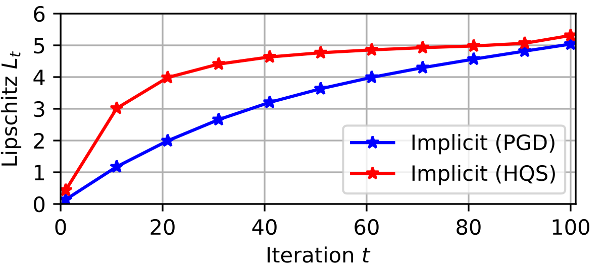{width=70% fig-align="left"}

Lipschitz constant of $\mathbf{y}_t(\cdot)$ grows from ~0.1 to ~5.0 over iterations
:::

::: {.column width="4%"}
<!-- empty -->
:::

::: {.column width="48%"}
* Imaging Quality Improves

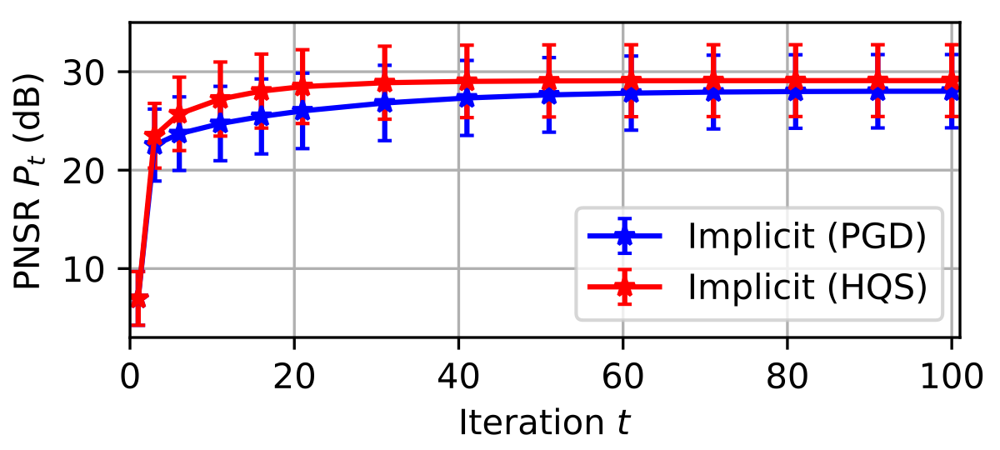{width=70% fig-align="left"}

PSNR rises and stabilizes — $\mathbf{y}_t$ converges to the target
:::
::::

::: notes
Empirical Lipschitz grows as predicted.
Accuracy improves simultaneously.
:::

---

## Imaging: Visual Comparison

::: {layout-ncol=5}
{width=70% fig-align="left"}

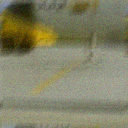{width=70% fig-align="left"}

{width=70% fig-align="left"}

{width=70% fig-align="left"}

{width=70% fig-align="left"}
:::

Implicit models produce sharper images with better textures (+2dB PSNR)

::: notes
Visual quality comparison. Implicit wins.
:::

---

## Case Study 2: Steady-State Navier-Stokes

2D incompressible flow on periodic domain:

$$(\mathbf{u} \cdot \nabla)\mathbf{u} + \nabla p = \nu \Delta \mathbf{u} + \mathbf{f}, \quad \nabla \cdot \mathbf{u} = 0$$

. . .

**Task:** Given force $\mathbf{f}$, predict velocity/vorticity solution

. . .

::: {.callout-note icon=false}
## Theorem
Under suitable conditions, the solution map $u_\ast(\mathbf{f})$ is locally Lipschitz.
:::

::: notes
Set up the PDE problem.
:::

---

## Implicit Fourier Neural Operator

$$\mathbf{z}_* = G_\Theta(\mathbf{z}_*, Q_\Phi(\mathbf{x})), \quad \mathbf{y}_* = Q_\Psi(\mathbf{z}_*)$$

- Core $G_\Theta$: Fourier Neural Operator (FNO)
- Encoder/decoder: pointwise MLPs

::: notes
Architecture for PDEs.
:::

---

## Navier-Stokes Results

::: {layout-ncol=2}
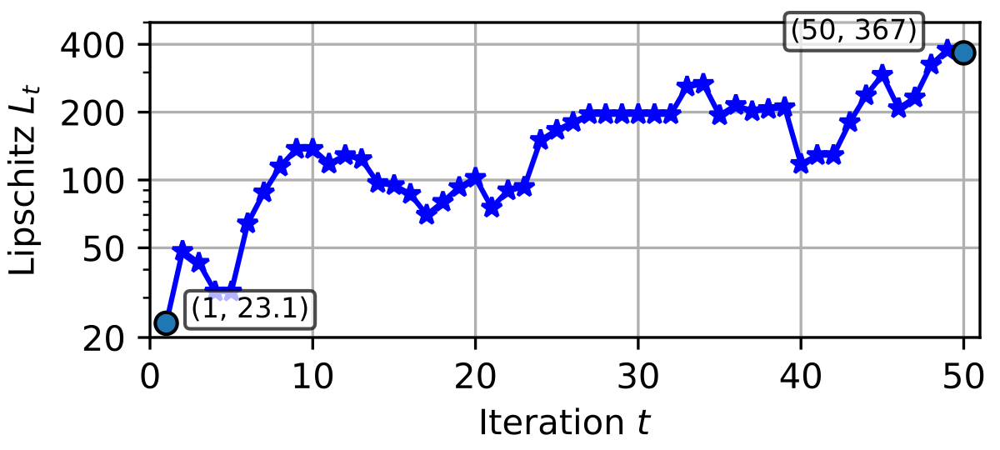{width=70% fig-align="left"}

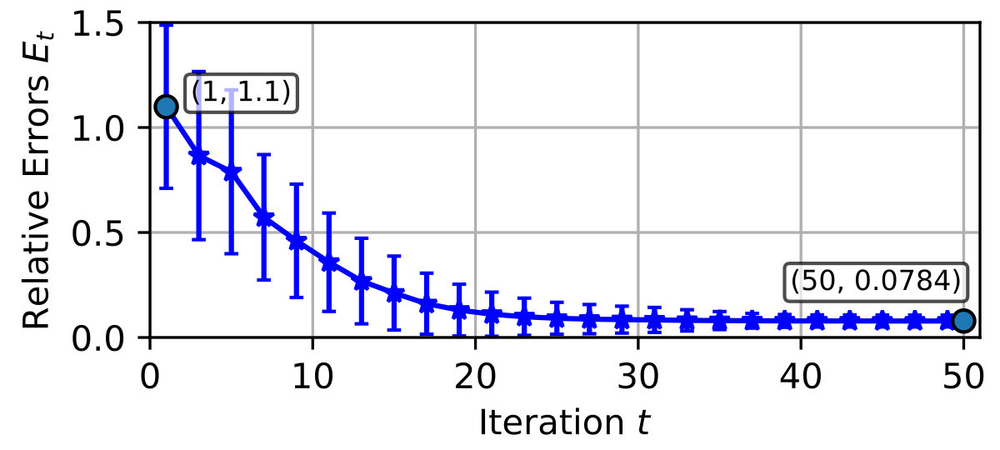{width=70% fig-align="left"}
:::

Same pattern: complexity grows, accuracy improves

::: notes
NS results match the theory.
:::

---

## Navier-Stokes: Visual Comparison

::: {layout-ncol=5}
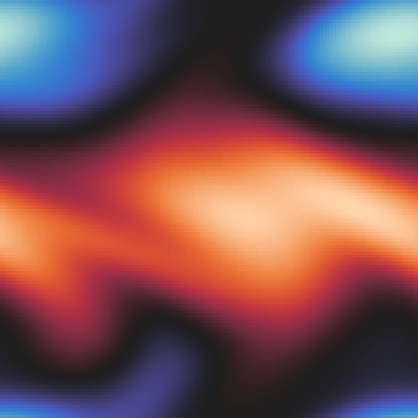

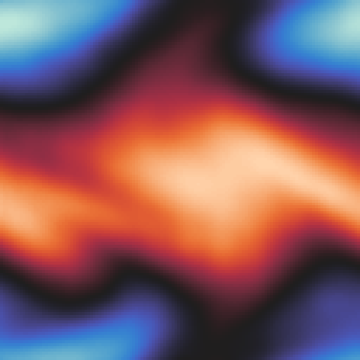

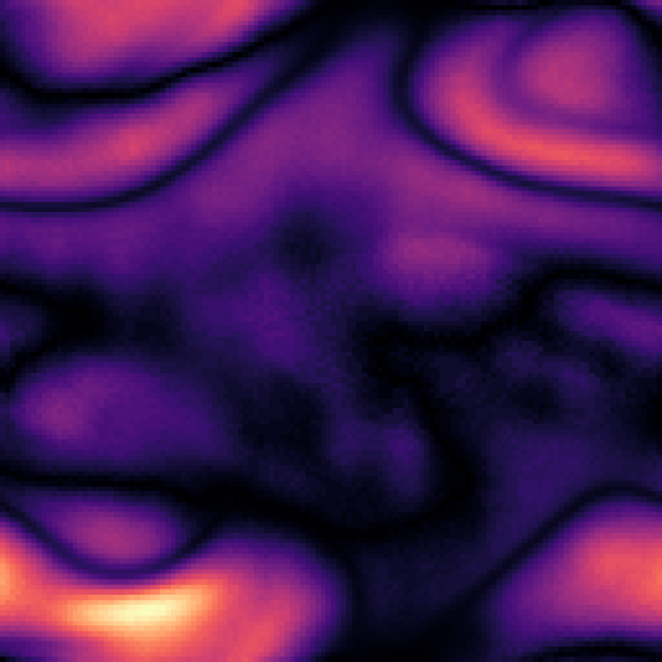

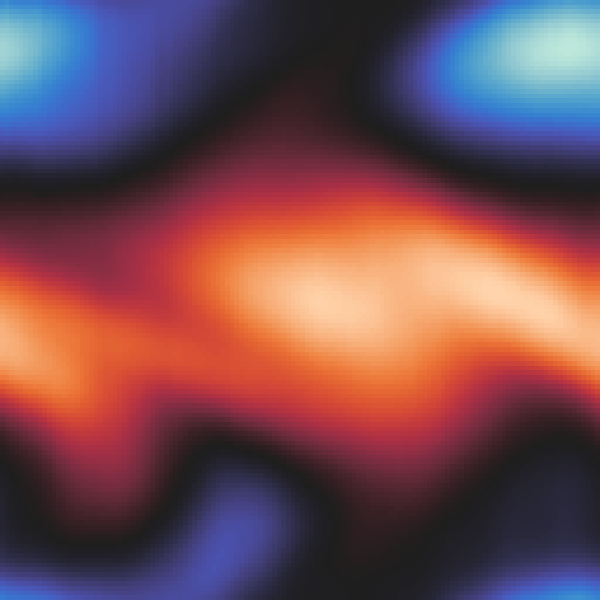

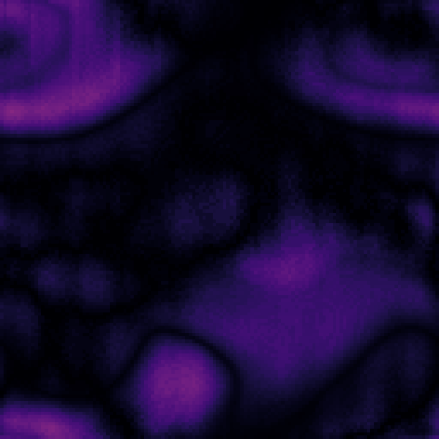
:::

Implicit FNO achieves 2× lower error with same parameters

::: notes
Visual comparison for NS.
:::

---

## Case Study 3: Linear Programming

$$\min_{\mathbf{y}} \mathbf{c}^\top \mathbf{y} \quad \text{s.t.} \quad \mathbf{A}\mathbf{y} \circ \mathbf{b}, \quad \mathbf{l} \le \mathbf{y} \le \mathbf{u}$$

. . .

**Input:** $\mathbf{x} = (\mathbf{A}, \mathbf{b}, \mathbf{c}, \circ, \mathbf{l}, \mathbf{u})$

**Output:** Optimal solution $\mathbf{y}_*(\mathbf{x})$ (when not unique, choose the min-$\ell_2$ one )

. . .

::: {.callout-note icon=false}
## Theorem
The LP solution map $\mathbf{y}_*(\mathbf{x})$ is locally Lipschitz on a dense subset.
:::

::: notes
LP setup and theoretical guarantee.
:::

---

## Graph Neural Network for LP

::: {style="font-size: 0.9em;"}
**LP as bipartite graph:**
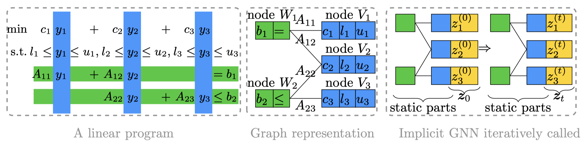{width=70% fig-align="left"}

- $n$ variable nodes: store $(c_j, l_j, u_j)$; $m$ constraint nodes: store $(b_i, \circ_i)$
- Edges where $A_{ij} \neq 0$, with edge features $A_{ij}$
:::

. . .

**Implicit GNN:** $\mathbf{z}_* = G_\Theta(\mathbf{z}_*, Q_\Phi(\mathbf{x}))$, $\mathbf{y}_\ast = G_\Psi(\mathbf{z}_*)$

Iterate message passing until fixed point is reached


::: notes
GNN architecture for LP.
:::

---

## LP Results: Lipschitz Growth

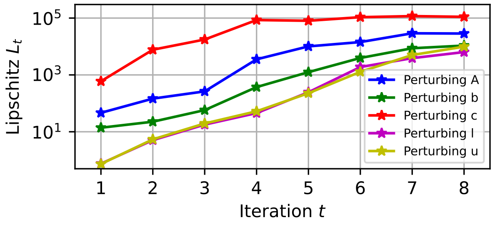{width=70% fig-align="left"}

Lipschitz grows across all perturbation modes

::: notes
LP Lipschitz results.
:::

---

## LP Results: Accuracy

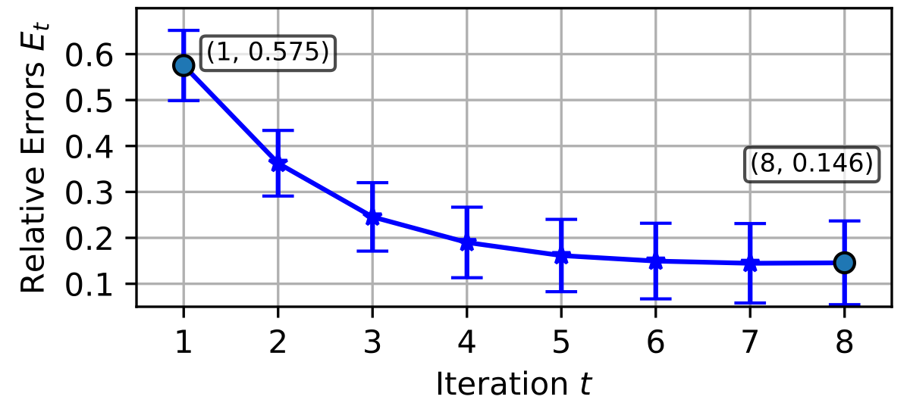{width=70% fig-align="left"}

Error decreases to 0.146 — convergence to good solutions

::: notes
LP accuracy results.
:::

---

## Implicit vs Explicit GNNs

| Model | Emb=4 | Emb=8 | Emb=16 | Emb=32 |
|-------|-------|-------|--------|--------|
| Explicit (test) | 0.397 | 0.273 | **0.283** | **0.318** |
| Implicit (test) | **0.218** | **0.177** | **0.152** | **0.156** |

- Implicit GNN wins at all sizes
- Explicit GNNs **overfit** at larger widths
- Implicit-4 beats Explicit-8!

::: notes
Comparison table. Implicit wins, especially at small sizes.
:::

---

## Case Study 4: Looped Transformers

From @geiping2025scaling: Shared block recycled over iterations

$$\mathbf{z}_t = G_\Theta(\mathbf{z}_{t-1}, Q_\Phi(\mathbf{x})), \quad \mathbf{y}_t = Q_\Psi(\mathbf{z}_t)$$

. . .

**Challenge:** Discrete token space — standard Lipschitz doesn't apply

**Prediction:** More iterations → more complex, context-sensitive mappings

::: notes
LLM setup. Different domain, same principle.
:::

---

## Semantic Sensitivity Emerges

::: {style="font-size: 0.9em;"}
| Iter | "Explain charge vs *voltage*" | "Explain charge vs *pay*" |
|------|---------------------------|----------------------|
| t=2 | (echoes input) | (echoes input) |
| t=4 | slight variations | slight variations |
| t=6 | potential difference... | (still near prompt) |
| t=8 | **electric charge in a system** | **money that a person owes** |
| t=32 | Physics definition (refined) | Finance definition (refined) |
:::


Inputs differ by **one word**, but uses completely different contexts

::: notes
Qualitative LLM results. Context sensitivity emerges.
:::

---

## LLM Quantitative Results

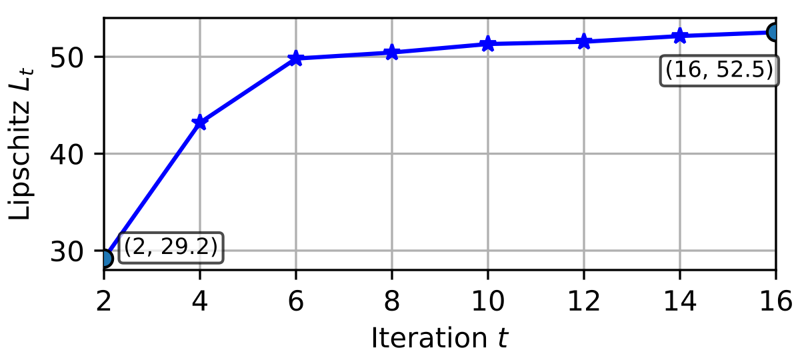{width=65% fig-align="center"}

Using Levenshtein distance: "Lipschitz" grows from 29 to 53

More iterations → greater semantic discrimination

::: notes
Quantitative LLM results.
:::

---

## Summary of Results

::: {style="font-size: 0.9em;"}
1. **Tight characterization:** Regular implicit models $\Leftrightarrow$ Locally Lipschitz maps

2. **Expressivity scales with iterations:** Simple $G$ + test-time compute → complex $F$

3. **Validated across domains:** Imaging, PDEs, LP, LLM reasoning
:::

. . .


::: {.callout-tip appearance="simple"}
**Explicit models:** Scale *parameters* for expressivity

**Implicit models:** Scale *test-time compute* (also *parameters*) for expressivity
:::

::: notes
Summarize the main results.
:::

---

## Thank You

::: {style="text-align: center; font-size: 1.5em; margin-top: 2em;"}
**Questions?**
:::

::: notes
End of main deck.
:::

---

## Backup Slides

::: notes
Backup section begins.
:::

---

## Proof Sketch: Sufficiency

**Construction:** $G(\mathbf{y}, \mathbf{x}) = F(\mathbf{x}) + (1 - \varepsilon(\mathbf{x}))(\mathbf{y} - F(\mathbf{x}))$

. . .

**Key idea:** Make step size $\varepsilon(\mathbf{x})$ *adaptive*

- Where $F$ is steep: $\varepsilon(\mathbf{x}) \to 0$ (slow down)
- Where $F$ is smooth: $\varepsilon(\mathbf{x})$ can be larger

. . .

This keeps $G$ globally Lipschitz while allowing singular $F$

::: notes
Sketch of sufficiency proof.
:::

---

## Proof Sketch: Necessity

**Key observation:** Fixed-point equation $\mathbf{y}_* = G(\mathbf{y}_*, \mathbf{x})$

. . .

Local Lipschitz of $\mathbf{y}_*$ bounded by:

$$\text{Lip}(\mathbf{y}_*) \lesssim \frac{\text{Lip}(G \text{ in } \mathbf{x})}{1 - \mu(\mathbf{x})}$$

where $\mu(\mathbf{x})$ is the contraction modulus

. . .

Blowup in $\mathbf{y}_*$ requires $\mu(\mathbf{x}) \to 1$ (slowing convergence)

::: notes
Sketch of necessity proof.
:::

---

## Generalization Discussion

**Q: Does large Lipschitz constant hurt generalization?**

. . .

**A:** The sensitivity is *inherent to the target* $F$, not the representation

- Any faithful model must track $F$'s sharp variations
- Implicit formulation regularizes via the *simple* operator $G$

. . .

Experiments confirm: implicit models generalize well despite high fixed-point Lipschitz

::: notes
Address generalization concerns.
:::

---

## Additional Imaging Experiments

Smaller implicit model vs larger explicit model:

| Model | Parameters | PSNR |
|-------|-----------|------|
| Explicit UNet | 32.64 M | 26.97 dB |
| Implicit PGD | 32.64 M | 28.20 dB |
| Implicit HQS | 32.64 M | 29.18 dB |

. . .

Even smaller implicit models can outperform larger explicit ones!

::: notes
Additional imaging results.
:::

---

## Training Strategies {.scrollable}

::: {style="font-size: 0.9em;"}
**Unrolling:** Minimize $\ell(\mathbf{y}_T, \mathbf{y}_*)$ for fixed $T$ iterations [@geng2021training]

- Simple to implement
- Memory grows with $T$

**Implicit differentiation (DEQ):** [@bai2019deep]

- Differentiate fixed-point condition via implicit function theorem
- Constant memory, but requires solving linear system

**Jacobian-free backprop:** [@fung2022jfb]

- Only differentiate through last iteration
- Constant memory + simpler implementation
:::

::: notes
Training approaches for implicit models.
:::

---

## Related Work: Neural Operators {.scrollable}

::: {style="font-size: 0.9em;"}
For scientific computing, neural operators learn mappings between function spaces:

- DeepONet [@lu2021deeponet]
- Fourier Neural Operator [@li2021fourier]
- Physics-Informed Neural Networks [@raissi2019pinn]

. . .

Our implicit FNO combines:

- FNO's spectral efficiency
- Implicit model's iterative refinement
:::

::: notes
Context in neural operators literature.
:::

---

## LP: Detailed Results by Perturbation

::: {style="font-size: 0.9em;"}
| Perturbation | Explicit (test) | Implicit (test) |
|--------------|-----------------|-----------------|
| Perturb $\mathbf{A}$ | 0.31 | **0.18** |
| Perturb $\mathbf{b}$ | 0.29 | **0.17** |
| Perturb $\mathbf{c}$ | 0.27 | **0.16** |
| Perturb $\mathbf{l}$ | 0.28 | **0.16** |
| Perturb $\mathbf{u}$ | 0.28 | **0.16** |

Implicit GNN is more robust to all perturbation types
:::

::: notes
Detailed LP results by perturbation type.
:::

---

## References

::: {style="font-size: 0.8em;"}
::: {#refs}
:::
:::
